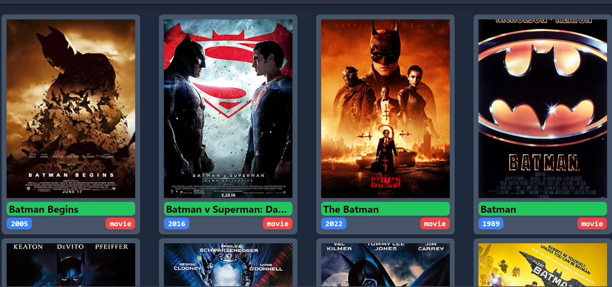

# My React Movie Search App

My React Movie Search App is a web application that allows users to search for movies using the OMDB API and view detailed information about each movie. This application is built using React, Tailwind CSS, and the OMDB API.
The Website is fully Responsive for all devices.




## Features

- Search for movies by title.
- Display a list of movie search results.
- View detailed information about a selected movie.
- Responsive design for various screen sizes.

## Installation

1. Clone this repository to your local machine:

   ```bash
   git clone https://github.com/Chayan9991/your-react-movie-app.git
